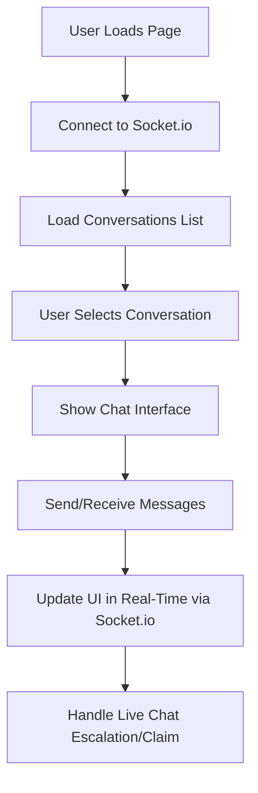

# Omni-Chat App Architecture & Logic

## Overview

This app provides a unified chat platform for WhatsApp and Facebook, supporting:
- Real-time agent/customer messaging
- Conversation locking and escalation
- Live chat claim & reclaim
- Webhook processing for WhatsApp/Facebook
- Agent online/offline management

---

## 1. Backend Logic (Node.js/Express/MongoDB)

### Key Components

- **Models:**  
  - `User`: Agents/customers, online status, platform IDs
  - `Conversation`: Tracks participants, agent lock, status, escalation
  - `Message`: Stores chat messages (inbound/outbound)
- **Controllers:**  
  - `whatsappController.js`: Handles WhatsApp webhooks, locking, escalation
  - `facebookController.js`: Handles Facebook webhooks, user mapping, locking, escalation
  - `messageController.js`: Sending messages (API)
  - `userControllers.js`: User management
- **Socket.io:**  
  - Real-time events for new messages, live chat requests, claims

### Backend Flowchart (Written)

```mermaid
flowchart TD
    A[Webhook Received (WhatsApp/Facebook)] --> B[Parse Message & Sender Info]
    B --> C[Find/Create User (by platform ID)]
    C --> D[Find/Create Conversation]
    D --> E[Check Conversation Lock]
    E -- Locked? --> F[Is Agent Online?]
    F -- Yes --> G[Allow]
    G --> H[Save Message, Emit Events]
    F -- No --> I[Broadcast Escalation]
    I --> H
    E -- Not Locked --> J[Assign Agent, Lock]
    J --> H
    H --> K[Respond (Bot or Agent)]
```

---

## 2. Middleend Logic (API & Routing)

### Key Components

- **API Endpoints:**  
  - `/api/conversation`: List/create conversations
  - `/api/messages`: Send/receive messages
  - `/api/whatsapp/webhook`: WhatsApp webhook
  - `/api/facebook/webhook`: Facebook webhook
  - `/api/users`: User CRUD, online/offline
- **Middleware:**  
  - Auth, input validation, error handling

### Middleend Flowchart (Written)

```mermaid
flowchart TD
    A[Frontend Request/API Call] --> B[Express Route Handler]
    B --> C[Authentication Middleware]
    C --> D[Controller Logic]
    D --> E[Database Operation (Mongoose)]
    E --> F[Return JSON Response]
```

---

## 3. Frontend Logic (HTML/JS/CSS)

### Key Components

- **Pages:**  
  - `whatsapp.html`, `facebook.html`, `dashboard.html`, `login.html`
- **JS:**  
  - `whatsapp.js`, `facebook.js`, `dashboard.js`, `shared.js`
  - UI state, socket.io client, message rendering, live chat claim, notifications
- **UI Elements:**  
  - Conversation list, chat window, message input, agent claim/escalation banners

### Frontend Flowchart (Written)



---

## 4. Conversation Locking & Escalation Logic

### Locking

- When an agent replies, the conversation is **locked** to them.
- Other agents cannot reply unless the lock is released or the conversation is escalated.
- If the agent goes offline, an **escalation event** is broadcast to all agents.

### Escalation

- When escalated, any online agent can claim the conversation.
- The original agent can reclaim if they come back online.
- Lock status and agent assignment are updated accordingly.

---

## 5. User ID Mapping (Facebook/WhatsApp)

- **External platform IDs** (Facebook sender/recipient, WhatsApp numbers) are always mapped to internal `User` documents.
- All conversation and message documents reference internal MongoDB ObjectIds.

---

## 6. Real-Time Events

- **Socket.io** is used for:
  - Broadcasting new messages
  - Notifying agents of new live chat requests
  - Claiming/reclaiming conversations
  - Updating UI for all clients in real-time

---

## 7. Error Handling & Edge Cases

- Robust validation for all incoming webhooks and API requests
- Handles agent offline/online transitions
- Prevents double-locking or unclaimed escalations
- All errors are logged and surfaced to the UI when appropriate

---

## 8. Deployment & Environment

- **Heroku** deployment with Node.js buildpack
- `.env` for secrets/tokens (not committed)
- **Procfile** for process type (web)

---

## 9. Example Sequence (End-to-End)

1. Customer sends WhatsApp or Facebook message.
2. Webhook endpoint receives and parses the message.
3. User and conversation are looked up/created.
4. If locked, agent status is checked:
    - If online, message is processed.
    - If offline, escalation event is broadcast.
5. Agent claims conversation and replies.
6. All clients update UI in real-time.

---

**For detailed logic, see the code in `controllers/`, `models/`, `routes/`, and `public/`.  
For UI/UX, see `public/whatsapp.html`, `public/whatsapp.js`, etc.**

---

If you want a graphical flowchart or more detail on any specific area, just let me know!

